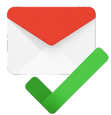

# Gmail Trusted Domain Login 

Gmail Trusted Domain Login is a Chrome extension that restricts Gmail logins to a user-defined trusted domain. Unauthorized login attempts are blocked and a custom alert is displayed, ensuring that only emails from the designated domain can access Gmail.

---

## Features

- **Trusted Domain Restriction:**  
  Only allows login attempts from email addresses within a specific, user-defined domain.
  
- **Custom Alert Messages:**  
  Provides clear feedback to users when an unauthorized login attempt is made.
  
- **Enhanced Security:**  
  Adds an extra layer of protection by preventing unauthorized Gmail access at the login stage.
  
- **Simple Configuration:**  
  Easily set and update the trusted domain through the extension’s options page.

---

## Installation

1. **Clone or Download the Repository:**

   ```bash
   git clone https://github.com/aenigma-lab/gmail-trusted-domain-login.git
